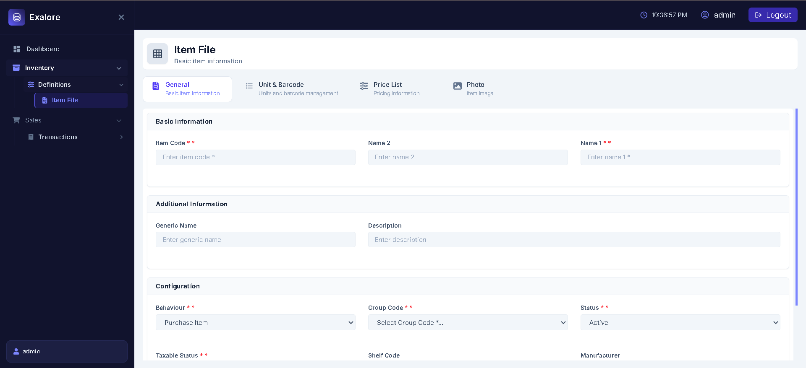

# ERP Exalore

## About

ERP Exalore is a showcase ERP application developed as part of an ERP development task. It demonstrates essential business management features, including item management, pricing, unit type management, image handling, sales quotation processing, and sales order management.

<p align="center">
  
</p>

## Project Requirements

* Python 3.12+
* Node.js 20+
* PostgreSQL
* Docker & Docker Compose
* Cloudinary account (optional, only for image uploads)

---

## Features

### Inventory & Product Management

* Create and manage item records
* Manage unit types and barcode information
* Handle item pricing and price lists
* Upload and manage item images using Cloudinary


### Sales Quotations

* Create and manage sales quotations
* Select customers and items for quotations
* Add item quantities, units, and pricing

### Sales Orders

* Create sales orders from quotations
* Manage customer sales orders
* Add items, quantities, and pricing

---

## Tools Used

### Frontend Tools

* React 19 — Modern UI development
* Vite — Fast development server and optimized builds
* React Router DOM — Client-side routing
* Tailwind CSS — Utility-first styling
* Axios — API communication
* React Hook Form — Form handling
* Zod — Form validation
* React Hot Toast — Notification system
* React Icons — Icon library

### Backend Tools

* Python 3.x — Backend runtime
* Django 6.x — Web framework
* Django REST Framework — REST API development
* PostgreSQL — Relational database
* djangorestframework-simplejwt — JWT authentication
* django-cors-headers — CORS handling
* django-environ — Environment variable management

## Setup .env Files

### Backend Environment Setup

Navigate to the backend directory:

```bash
cd backend
```

Copy the environment template:

```bash
cp .env.example .env
```

Configure the values inside.

> **Note:** Cloudinary configuration is required only for image uploads. Create a Cloudinary account and configure the Cloudinary credentials accordingly.
>
> **Database:** The default PostgreSQL settings are configured for the Docker-based setup provided with this project. For the initial setup, you can leave the database configuration unchanged unless you are using an external PostgreSQL instance.

Save the file after configuration.

### Frontend Environment Setup

Navigate to the frontend directory:

```bash
cd frontend
```

Copy the environment template:

```bash
cp .env.example .env
```

> **Note:** No changes are required to the frontend `.env` file for the default setup. The provided configuration is ready to use as-is.

Save the file.

---

## Docker Setup

This project includes Docker support for local development.

> **Note:** Before running the commands below, ensure you are inside the `backend` directory where the `docker-compose.yml` file is located.

Start all backend services:

```bash
docker compose up -d --build
```
> **Note:** The following commands are optional and only need to be executed when required during development or project setup.

Stop all services:

```bash
docker compose down
```

Run migrations:

```bash
docker compose exec backend python manage.py migrate
```

Create a superuser:

```bash
docker compose exec backend python manage.py createsuperuser
```

---

The backend API will be available at:

```text
http://localhost:8000
```


---
## Frontend Installation

Navigate to the frontend folder:

```bash
cd frontend
```

> **Note:** Ensure you are inside the `frontend` directory before running the commands below.

Install dependencies:

```bash
npm install
```

Start development server:

```bash
npm run dev
```

Frontend URL:

```text
http://localhost:5173
```

---

## Project Modules

* Login Page
* Dashboard
* Inventory - Item List
* Sales Quotations
* Sales Orders

---

ERP Exalore — Enterprise Resource Planning Simplified

© 2026 ERP Exalore. All rights reserved.
